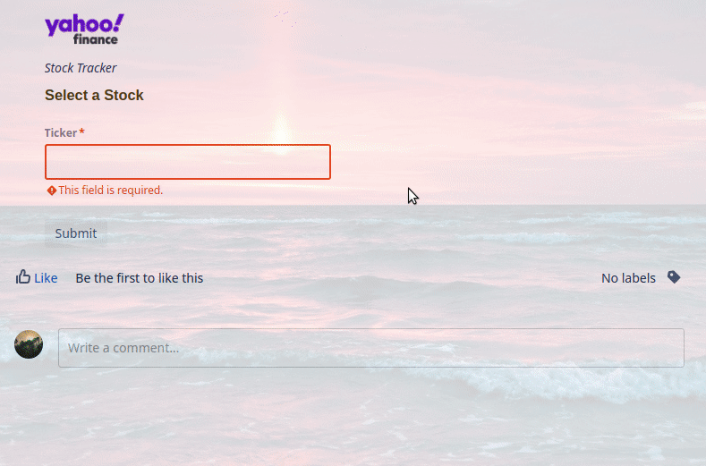

<h1 align="center" style="font-weight:bold;font-size:32px;">Forge Stock Ticker</h1>

<div align="center">
  
  <p id="desc" style="font-style:italic;text-align:center;">This project contains a Forge app written in Typescript that displays stock information using the Yahoo! Finance API. 
  </p>
</div>

See [developer.atlassian.com/platform/forge/](https://developer.atlassian.com/platform/forge) for documentation and tutorials explaining Forge.

## Requirements

See [Set up Forge](https://developer.atlassian.com/platform/forge/set-up-forge/) for instructions to get set up.

## Quick start

- Modify your app by editing the `src/index.tsx` file.

- Build and deploy your app by running:
```
forge deploy
```

- Install your app in an Atlassian site by running:
```
forge install
```

- Develop your app by running `forge tunnel` to proxy invocations locally:
```
forge tunnel
```

### Notes
- Use the `forge deploy` command when you want to persist code changes.
- Use the `forge install` command when you want to install the app on a new site.
- Once the app is installed on a site, the site picks up the new app changes you deploy without needing to rerun the install command.

## Support

See [Get help](https://developer.atlassian.com/platform/forge/get-help/) for how to get help and provide feedback.
